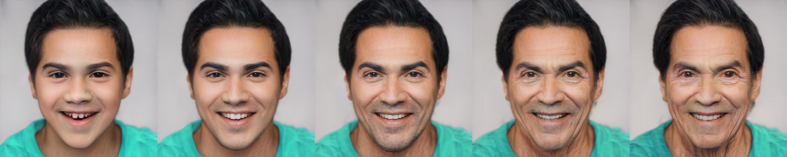
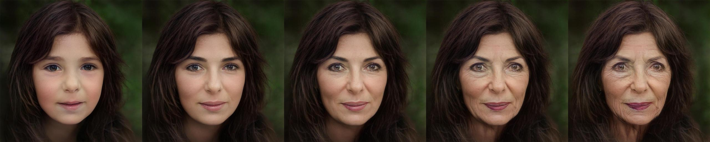
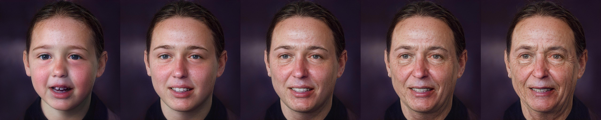
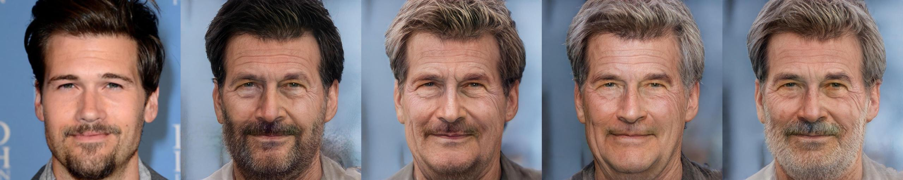

# Only a Matter of Style: Age Transformation Using a Style-Based Regression Model (SIGGRAPH 2021)

> The  task of age transformation illustrates the change of an individual's appearance over time. Accurately modeling this complex transformation over an input facial image is extremely challenging as it requires making convincing and possibly large changes to facial features and head shape, while still preserving the input identity. In this work, we present an image-to-image translation method that learns to directly encode real facial images into the latent space of a pre-trained unconditional GAN (e.g., StyleGAN) subject to a given aging shift. We employ a pre-trained age regression network used to explicitly guide the encoder to generate the latent codes corresponding to the desired age. In this formulation, our method approaches the continuous aging process as a regression task between the input age and desired target age, providing fine-grained control on the generated image. Moreover, unlike other approaches that operate solely in the latent space using a prior on the path controlling age, our method learns a more disentangled, non-linear path. We demonstrate that the end-to-end nature of our approach, coupled with the rich semantic latent space of StyleGAN, allows for further editing of the generated images. Qualitative and quantitative evaluations show the advantages of our method compared to state-of-the-art approaches.

<a href="https://arxiv.org/abs/2102.02754"></a>
<a href="https://opensource.org/licenses/MIT"></a>
<a href="https://youtu.be/X_pYC_LtBFw"></a>  

Inference Notebook: &nbsp;<a href="http://colab.research.google.com/github/yuval-alaluf/SAM/blob/master/notebooks/inference_playground.ipynb"></a>  
Animation Notebook: <a href="http://colab.research.google.com/github/yuval-alaluf/SAM/blob/master/notebooks/animation_inference_playground.ipynb"></a>

<a href="https://replicate.ai/yuval-alaluf/sam"></a>

<p align="center">

</p>

## Description   
Official Implementation of our Style-based Age Manipulation (SAM) paper for both training and evaluation. SAM 
allows modeling fine-grained age transformation using a single input facial image

<p align="center">


</p>


## Getting Started
### Prerequisites
- Linux or macOS
- NVIDIA GPU + CUDA CuDNN (CPU may be possible with some modifications, but is not inherently supported)
- Python 3

### Installation
- Dependencies:  
We recommend running this repository using [Anaconda](https://docs.anaconda.com/anaconda/install/). 
All dependencies for defining the environment are provided in `environment/sam_env.yaml`.

## Pretrained Models
Please download the pretrained aging model from the following links.

| Path | Description
| :--- | :----------
|[SAM](https://drive.google.com/file/d/1XyumF6_fdAxFmxpFcmPf-q84LU_22EMC/view?usp=sharing)  | SAM trained on the FFHQ dataset for age transformation.

You can run this to download it to the right place:

```
mkdir pretrained_models
pip install gdown
gdown "https://drive.google.com/u/0/uc?id=1XyumF6_fdAxFmxpFcmPf-q84LU_22EMC&export=download" -O pretrained_models/sam_ffhq_aging.pt
wget "https://github.com/italojs/facial-landmarks-recognition/raw/master/shape_predictor_68_face_landmarks.dat"
```

In addition, we provide various auxiliary models needed for training your own SAM model from scratch.  
This includes the pretrained pSp encoder model for generating the encodings of the input image and the aging classifier 
used to compute the aging loss during training.

| Path | Description
| :--- | :----------
|[pSp Encoder](https://drive.google.com/file/d/1bMTNWkh5LArlaWSc_wa8VKyq2V42T2z0/view?usp=sharing) | pSp taken from [pixel2style2pixel](https://github.com/eladrich/pixel2style2pixel) trained on the FFHQ dataset for StyleGAN inversion.
|[FFHQ StyleGAN](https://drive.google.com/file/d/1EM87UquaoQmk17Q8d5kYIAHqu0dkYqdT/view?usp=sharing) | StyleGAN model pretrained on FFHQ taken from [rosinality](https://github.com/rosinality/stylegan2-pytorch) with 1024x1024 output resolution.
|[IR-SE50 Model](https://drive.google.com/file/d/1KW7bjndL3QG3sxBbZxreGHigcCCpsDgn/view?usp=sharing) | Pretrained IR-SE50 model taken from [TreB1eN](https://github.com/TreB1eN/InsightFace_Pytorch) for use in our ID loss during training.
|[VGG Age Classifier](https://drive.google.com/file/d/1atzjZm_dJrCmFWCqWlyspSpr3nI6Evsh/view?usp=sharing) | VGG age classifier from DEX and fine-tuned on the FFHQ-Aging dataset for use in our aging loss

By default, we assume that all auxiliary models are downloaded and saved to the directory `pretrained_models`. 
However, you may use your own paths by changing the necessary values in `configs/path_configs.py`. 

## Training
### Preparing your Data
Please refer to `configs/paths_config.py` to define the necessary data paths and model paths for training and inference.   
Then, refer to `configs/data_configs.py` to define the source/target data paths for the train and test sets as well as the 
transforms to be used for training and inference.
    
As an example, we can first go to `configs/paths_config.py` and define:
``` 
dataset_paths = {
    'ffhq': '/path/to/ffhq/images256x256'
    'celeba_test': '/path/to/CelebAMask-HQ/test_img',
}
```
Then, in `configs/data_configs.py`, we define:
``` 
DATASETS = {
	'ffhq_aging': {
		'transforms': transforms_config.AgingTransforms,
		'train_source_root': dataset_paths['ffhq'],
		'train_target_root': dataset_paths['ffhq'],
		'test_source_root': dataset_paths['celeba_test'],
		'test_target_root': dataset_paths['celeba_test'],
	}
}
``` 
When defining the datasets for training and inference, we will use the values defined in the above dictionary.


### Training SAM
The main training script can be found in `scripts/train.py`.   
Intermediate training results are saved to `opts.exp_dir`. This includes checkpoints, train outputs, and test outputs.  
Additionally, if you have tensorboard installed, you can visualize tensorboard logs in `opts.exp_dir/logs`.

Training SAM with the settings used in the paper can be done by running the following command:
```
python scripts/train.py \
--dataset_type=ffhq_aging \
--exp_dir=/path/to/experiment \
--workers=6 \
--batch_size=6 \
--test_batch_size=6 \
--test_workers=6 \
--val_interval=2500 \
--save_interval=10000 \
--start_from_encoded_w_plus \
--id_lambda=0.1 \
--lpips_lambda=0.1 \
--lpips_lambda_aging=0.1 \
--lpips_lambda_crop=0.6 \
--l2_lambda=0.25 \
--l2_lambda_aging=0.25 \
--l2_lambda_crop=1 \
--w_norm_lambda=0.005 \
--aging_lambda=5 \
--cycle_lambda=1 \
--input_nc=4 \
--target_age=uniform_random \
--use_weighted_id_loss
```

### Additional Notes
- See `options/train_options.py` for all training-specific flags. 
- Note that using the flag `--start_from_encoded_w_plus` requires you to specify the path to the pretrained pSp encoder.  
    By default, this path is taken from `configs.paths_config.model_paths['pretrained_psp']`.
- If you wish to resume from a specific checkpoint (e.g. a pretrained SAM model), you may do so using `--checkpoint_path`.


## Notebooks 
### Inference Notebook
To help visualize the results of SAM we provide a Jupyter notebook found in `notebooks/inference_playground.ipynb`.   
The notebook will download the pretrained aging model and run inference on the images found in `notebooks/images`.  

In addition, [Replicate](https://replicate.ai/) have created a demo for SAM where you can easily upload an image and run SAM on a desired set of ages! Check
out the demo [here](https://replicate.ai/yuval-alaluf/sam).

### MP4 Notebook
To show full lifespan results using SAM we provide an additional notebook `notebooks/animation_inference_playground.ipynb` that will 
run aging on multiple ages between 0 and 100 and interpolate between the results to display full aging. 
The results will be saved as an MP4 files in `notebooks/animations` showing the aging and de-aging results.

## Testing
### Inference
Having trained your model or if you're using a pretrained SAM model, you can use `scripts/inference.py` to run inference
on a set of images.   
For example, 
```
python scripts/inference.py \
--exp_dir=/path/to/experiment \
--checkpoint_path=experiment/checkpoints/best_model.pt \
--data_path=/path/to/test_data \
--test_batch_size=4 \
--test_workers=4 \
--couple_outputs
--target_age=0,10,20,30,40,50,60,70,80
```
Additional notes to consider: 
- During inference, the options used during training are loaded from the saved checkpoint and are then updated using the 
test options passed to the inference script.
- Adding the flag `--couple_outputs` will save an additional image containing the input and output images side-by-side in the sub-directory
`inference_coupled`. Otherwise, only the output image is saved to the sub-directory `inference_results`.
- In the above example, we will run age transformation with target ages 0,10,...,80.
    - The results of each target age are saved to the sub-directories `inference_results/TARGET_AGE` and `inference_coupled/TARGET_AGE`.
- By default, the images will be saved at resolution of 1024x1024, the original output size of StyleGAN. 
    - If you wish to save outputs resized to resolutions of 256x256, you can do so by adding the flag `--resize_outputs`.

### Side-by-Side Inference 
The above inference script will save each aging result in a different sub-directory for each target age. Sometimes, 
however, it is more convenient to save all aging results of a given input side-by-side like the following: 

<p align="center">

</p>

To do so, we provide a script `inference_side_by_side.py` that works in a similar manner as the regular inference script: 
```
python scripts/inference_side_by_side.py \
--exp_dir=/path/to/experiment \
--checkpoint_path=experiment/checkpoints/best_model.pt \
--data_path=/path/to/test_data \
--test_batch_size=4 \
--test_workers=4 \
--target_age=0,10,20,30,40,50,60,70,80
```
Here, all aging results 0,10,...,80 will be save side-by-side with the original input image.

### Reference-Guided Inference
In the paper, we demonstrated how one can perform style-mixing on the fine-level style inputs with a reference image
to control global features such as hair color. For example, 

<p align="center">

</p>

To perform style mixing using reference images, we provide the script `reference_guided_inference.py`. Here, 
we first perform aging using the specified target age(s). Then, style mixing is performed using the specified 
reference images and the specified layers. For example, one can run: 
```
python scripts/reference_guided_inference.py \
--exp_dir=/path/to/experiment \
--checkpoint_path=experiment/checkpoints/best_model.pt \
--data_path=/path/to/test_data \
--test_batch_size=4 \
--test_workers=4 \
--ref_images_paths_file=/path/to/ref_list.txt \
--latent_mask=8,9 \
--target_age=50,60,70,80
```
Here, the reference images should be specified in the file defined by `--ref_images_paths_file` and should have the 
following format:
```
/path/to/reference/1.jpg
/path/to/reference/2.jpg
/path/to/reference/3.jpg
/path/to/reference/4.jpg
/path/to/reference/5.jpg
```
In the above example, we will aging using 4 different target ages. For each target age, we first transform the 
test samples defined by `--data_path` and then perform style mixing on layers 8,9 defined by `--latent_mask`. 
The results of each target age are saved in its own sub-directory.

### Style Mixing 
Instead of performing style mixing using a reference image, you can perform style mixing using randomly generated 
w latent vectors by running the script `style_mixing.py`. This script works in a similar manner to the reference
guided inference except you do not need to specify the `--ref_images_paths_file` flag.

## Repository structure
| Path | Description 
| :--- | :---
| SAM | Repository root folder
| &boxvr;&nbsp; configs | Folder containing configs defining model/data paths and data transforms
| &boxvr;&nbsp; criteria | Folder containing various loss criterias for training
| &boxvr;&nbsp; datasets | Folder with various dataset objects and augmentations
| &boxvr;&nbsp; docs | Folder containing images displayed in the README
| &boxvr;&nbsp; environment | Folder containing Anaconda environment used in our experiments
| &boxvr; models | Folder containing all the models and training objects
| &boxv;&nbsp; &boxvr;&nbsp; encoders | Folder containing various architecture implementations
| &boxv;&nbsp; &boxvr;&nbsp; stylegan2 | StyleGAN2 model from [rosinality](https://github.com/rosinality/stylegan2-pytorch)
| &boxv;&nbsp; &boxvr;&nbsp; psp.py | Implementation of pSp encoder
| &boxv;&nbsp; &boxur;&nbsp; dex_vgg.py | Implementation of DEX VGG classifier used in computation of aging loss
| &boxvr;&nbsp; notebook | Folder with jupyter notebook containing SAM inference playground
| &boxvr;&nbsp; options | Folder with training and test command-line options
| &boxvr;&nbsp; scripts | Folder with running scripts for training and inference
| &boxvr;&nbsp; training | Folder with main training logic and Ranger implementation from [lessw2020](https://github.com/lessw2020/Ranger-Deep-Learning-Optimizer)
| &boxvr;&nbsp; utils | Folder with various utility functions
|  | 


## Credits
**StyleGAN2 model and implementation:**  
https://github.com/rosinality/stylegan2-pytorch  
Copyright (c) 2019 Kim Seonghyeon  
License (MIT) https://github.com/rosinality/stylegan2-pytorch/blob/master/LICENSE  

**IR-SE50 model and implementations:**  
https://github.com/TreB1eN/InsightFace_Pytorch  
Copyright (c) 2018 TreB1eN  
License (MIT) https://github.com/TreB1eN/InsightFace_Pytorch/blob/master/LICENSE  

**Ranger optimizer implementation:**  
https://github.com/lessw2020/Ranger-Deep-Learning-Optimizer   
License (Apache License 2.0) https://github.com/lessw2020/Ranger-Deep-Learning-Optimizer/blob/master/LICENSE  

**LPIPS model and implementation:**  
https://github.com/S-aiueo32/lpips-pytorch  
Copyright (c) 2020, Sou Uchida  
License (BSD 2-Clause) https://github.com/S-aiueo32/lpips-pytorch/blob/master/LICENSE  

**DEX VGG model and implementation:**  
https://github.com/InterDigitalInc/HRFAE  
Copyright (c) 2020, InterDigital R&D France  
https://github.com/InterDigitalInc/HRFAE/blob/master/LICENSE.txt

**pSp model and implementation:**   
https://github.com/eladrich/pixel2style2pixel  
Copyright (c) 2020 Elad Richardson, Yuval Alaluf  
https://github.com/eladrich/pixel2style2pixel/blob/master/LICENSE

## Acknowledgments
This code borrows heavily from [pixel2style2pixel](https://github.com/eladrich/pixel2style2pixel)

## Citation
If you use this code for your research, please cite our paper <a href="https://arxiv.org/abs/2102.02754">Only a Matter of Style: Age Transformation Using a Style-Based Regression Model</a>:

```
@article{alaluf2021matter,
    author = {Alaluf, Yuval and Patashnik, Or and Cohen-Or, Daniel},
    title = {Only a Matter of Style: Age Transformation Using a Style-Based Regression Model},
    journal = {ACM Trans. Graph.},
    issue_date = {August 2021},
    volume = {40},
    number = {4},
    year = {2021},
    articleno = {45},
    publisher = {Association for Computing Machinery},
    url = {https://doi.org/10.1145/3450626.3459805}
}
```
